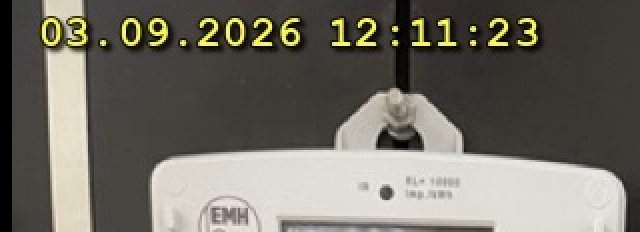

# burn_time 🔥⏰

Tiny Python tool to burn a timestamp visibly into your photos, just like the old-fashioned date stamp on analog compact cameras.



## Features

✨ **Smart date detection** — Automatically extracts the recording date from:
- 📷 EXIF metadata (DateTimeOriginal/DateTimeDigitized/DateTime)
- 📝 Manual date argument (override or fallback)
- 📁 File creation date from your filesystem

🎨 **Highly customizable** — Control position, color, font, size, format, and margins

🖼️ **Multiple formats** — Supports JPEG, PNG, TIFF, and (optionally) HEIC/HEIF from Photos app

🔍 **Readable by design** — Soft shadows + dark outlines make text pop against any background

⚙️ **Batch processing** — Use glob patterns to process hundreds of photos at once

🧪 **Safe by default** — Creates new files with a suffix (e.g., `photo_dated.jpg`); use `--in-place` to overwrite

⏭️ **Preview mode** — Dry-run flag to see exactly what will happen before committing

## Installation

Requires **Python 3.7+** and **Pillow**:

```bash
pip3 install Pillow
```

**Optional:** For HEIC/HEIF support (Photos app exports on macOS):
```bash
pip3 install pillow-heif
```

## Usage

```bash
./burn_time.py *.jpg                    # Process all JPEGs
python3 burn_time.py IMG_1234.jpg       # Single file
python3 burn_time.py ~/Photos/*.png     # Nested patterns
```

## Examples

### 🔹 Basic: German date format, top left, yellow
```bash
python3 burn_time.py *.jpg
```
Output: `photo_dated.jpg` with timestamp like `09.09.2026 14:30:45` (yellow, top-left)

---

### 🔹 Top right, red, custom format
```bash
python3 burn_time.py *.jpg --position tr --color red --format "yyyy/mm/dd hh:mm:ss"
```
Positions: `tl` (top-left, **default**), `tr` (top-right), `bl` (bottom-left), `br` (bottom-right), `c` (center)

---

### 🔹 Override date (no EXIF or wrong camera clock)
```bash
python3 burn_time.py IMG_1234.HEIC --date "24.12.2019 18:00:00"
```
Supported date formats:
- `YYYY-MM-DD HH:MM:SS`
- `YYYY-MM-DD`
- `DD.MM.YYYY HH:MM:SS`
- `DD.MM.YYYY`
- `DD/MM/YYYY HH:MM:SS`
- `DD/MM/YYYY`

---

### 🔹 Custom styling
```bash
python3 burn_time.py *.jpg \
  --position br \
  --color "#00FF00" \
  --font-size 24 \
  --margin 15 \
  --font /path/to/font.ttf
```

---

### 🔹 Overwrite originals (⚠️ **non-reversible**!)
```bash
python3 burn_time.py *.jpg --in-place
```

---

### 🔹 Save to a separate output directory
```bash
python3 burn_time.py *.jpg --output-dir ~/Dated_Photos --suffix "_archived"
```
Output: `~/Dated_Photos/photo_archived.jpg`

---

### 🔹 Dry-run: preview without writing
```bash
python3 burn_time.py *.jpg --dry-run
```
Shows what **would** happen:
```
[dry-run] IMG_1234.jpg: '09.09.2026 14:30:45' (Source: EXIF) -> IMG_1234_dated.jpg @ tl
```

---

### 🔹 Batch with verbose feedback
```bash
python3 burn_time.py *.jpg --verbose --quality 90
```
Full paths, processing details, and progress.

---

## Format Strings

Simple placeholders (case-insensitive, e.g., `DD`, `dd` both work):
```
yyyy  → 4-digit year (e.g., 2026)
yy    → 2-digit year (e.g., 26)
mm    → Month (01–12) [or Minute if after "hh"]
dd    → Day (01–31)
hh    → Hour (00–23)
ss    → Second (00–59)
```

**Example:** `dd.mm.yyyy HH:mm:ss` → `09.09.2026 14:30:45`

**Expert mode (strftime):** Use `%%` for raw strftime patterns:
```bash
python3 burn_time.py *.jpg --format "%%Y-%%m-%%d %%H:%%M"  # 2026-09-09 14:30
```

---

## All Options

```
positional arguments:
  files                    Image file(s) or glob patterns (*.jpg, *.png, etc.)

optional arguments:
  -h, --help               Show help
  -p, --position {tl,tr,bl,br,c}
                           Position on image (default: tl)
  -c, --color COLOR        Text color: 'yellow', 'red', 'blue', '#RRGGBB', etc. (default: yellow)
  -f, --format FORMAT      Date format string (default: "dd.mm.yyyy HH:mm:ss")
  --font PATH              Path to custom .ttf/.otf font
  --font-size SIZE         Font size in pixels (default: auto ~3.5% of height)
  --margin PIXELS          Distance from edges in pixels (default: auto ~2% of height)
  --date DATE              Manual date if no EXIF available
  -o, --output-dir DIR     Save to different directory
  --suffix SUFFIX          Output filename suffix (default: "_dated")
  --in-place               Overwrite original file (⚠️ not reversible!)
  --quality QUALITY        JPEG quality 0–100 (default: 95)
  --dry-run                Preview without writing
  -v, --verbose            Show full output paths and details
```

---

## Technical Notes

🔧 **Date source priority:**
1. EXIF metadata (most reliable)
2. `--date` argument (manual override)
3. File creation date (filesystem fallback)

🎯 **Styling:**
- Soft **shadow layer** with Gaussian blur for depth
- **Dark outline** around colored text for readability on any background
- Automatic **font size** & **margins** scale with image height

💾 **EXIF preservation:**
- Output JPEG retains original EXIF data (camera, lens, GPS, etc.)

🖼️ **HEIC/HEIF support:**
- Install `pillow-heif` to process Photos app exports
- Automatically detected and registered on startup

⚙️ **Cross-platform:**
- **macOS:** Native TTF/TTC font discovery (Menlo, Courier New, Arial)
- **Linux/Windows:** Falls back to default Pillow font if candidates not found

---

## Examples in the Wild

Restore vintage photo timestamps:
```bash
python3 burn_time.py ~/scanned_photos/*.jpg --date "15.08.1995 12:00:00" --color "#FFA500"
```

Archive with consistent formatting:
```bash
python3 burn_time.py ~/archive/*.jpg --format "yyyy-mm-dd" --output-dir ~/archive_dated --quality 100
```

Batch process with custom font:
```bash
python3 burn_time.py ~/vacation/*.jpg --font /Library/Fonts/Courier.dfont --color white --position br
```

---

## Credits

AI-powered development. Tested on macOS. 🤖✨

MIT License (implied). Use freely!

---

## Troubleshooting

**Q: "Pillow is not installed"**
```bash
pip3 install Pillow
```

**Q: HEIC files not opening**
```bash
pip3 install pillow-heif
```

**Q: Font looks wrong**
- Check `--font` path
- Try `--font-size` to adjust
- Use `--dry-run` to preview first

**Q: Colors don't show as expected**
- Verify color name or hex code: `--color red` or `--color "#FF0000"`
- Use `--verbose` to see processing details

**Q: EXIF date is wrong**
- Use `--date` to override: `--date "2026-09-09 14:30:00"`
- Use `--dry-run` to check which source was used

---

**Enjoy! 🎞️**
